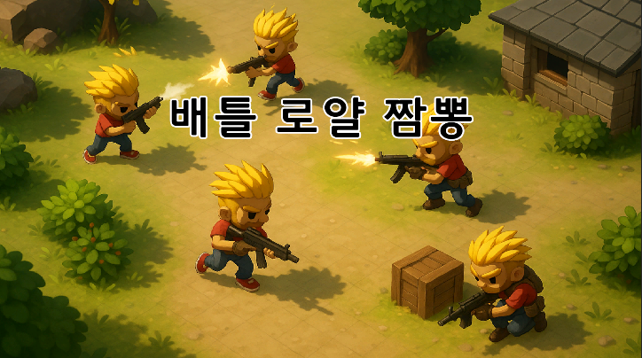

# 배틀 로얄 짬뽕 — ProjectK



> Unity 6 탑뷰 캐주얼 배틀로얄 · K-Digital Training 12기 · Team 4  
> Reference: Escape from Duckov / SuperVive / PUBG

---

## 프로젝트 소개

> 제한된 시야 속에서 탐색과 교전을 반복하는 캐쥬얼 탑뷰 배틀로얄

Unity 6 기반 탑뷰 배틀로얄 프로젝트입니다.

제한된 시야 속에서 아이템을 파밍하고,
탐색과 교전을 반복하며 마지막까지 생존하는 것이 목표입니다.

발표 당일 동일 LAN 환경에서 **20인 동시 플레이를 검증**했습니다. (Host 1 + Client 19)


- **팀 구성** : **오융택(팀장/본인)**, 박광호(팀원), 이정균(팀원), 이재훈(팀원)
- **개발 기간** : 2025.05.12 ~ 2025.05.29 (18일)
- **기획 의도** : 제한된 시야와 파밍 기반 전략을 중심으로 생존하는 긴장감 있는 전투 경험
- **팀 레포지토리** : https://github.com/Unity-Bootcamp-12/ProjectK
- **포트폴리오** : https://cyphen156.tistory.com/462

---
 
## 수행 역할

팀장으로서 게임 아키텍처 설계를 주도하고, 플레이어 시야 시스템과 입력 처리 구조를 담당했습니다. 

탑뷰 시점에서는 전장이 완전히 노출되기 때문에,  
플레이어의 정보 인지를 어떻게 제한할 것인가를 핵심 설계 문제로 삼았습니다.

이를 해결하기 위해 인지 → 판단 → 행동 흐름을 기준으로 시스템을 구성했습니다.

- 인지 시스템 : 플레이어 시야 시스템 (FOV + Stencil Buffer)
- 제어 구조   : 입력 → 상태 → 행동 흐름 설계
- 전투 피드백 : 크로스헤어 & 탄착군 연동
---

## 아키텍처 설계
 
### 컴포넌트 기반 허브 구조
 
`PlayerController` 를 중심으로 입력 → 상태 → 행동이 연결되는 구조로 설계했습니다.
 
- 입력은 인터페이스로 추상화
- 상태는 FSM으로 관리
- 실제 행동은 각 컴포넌트에서 실행
 
```
PlayerController (Component Holder)
├── PlayerStateMachine  — 상태 전이 (Idle / Walk / Dodge / Die)
├── PlayerStat          — HP / 스태미나 (Value Object)
├── PlayerMove          — 이동 / 회전
├── PlayerSight         — 시야 시스템
├── PlayerInventory     — 인벤토리
└── Gun                 — 총기 & 장비 시스템
```
 
→ 시스템 간 결합도를 낮추고, 흐름은 단일 경로로 유지했습니다.
 
---
 
### 상태 기반 설계 (PlayerStateMachine)
 
플레이어 행동을 `Idle / Walk / Dodge / Die` 상태로 구성했습니다.
 
- 상태 전이는 중앙에서 관리
- `isStateLock` 으로 상태 충돌 방지
- Dodge 상태는 코루틴 기반 자동 복귀
 
```csharp
case PlayerState.Dodge:
    SetPlayerAnimatorTrigger(currentPlayerState);
    StartCoroutine(ChangePlayerStateCoroutine(currentPlayerState, 0.8f));
    break;
```
 
→ 입력과 행동을 직접 연결하지 않고 "상태"를 통해 제어하도록 구조를 단순화했습니다.
 
---
 
### 입력 추상화 (IPlayerInputReceiver)
 
입력 수신 대상을 인터페이스로 분리했습니다.
 
- 입력 처리 대상 교체 가능
- 상태에 따라 입력 차단
- 로컬 플레이어만 입력 처리
 
```csharp
public interface IPlayerInputReceiver
{
    void InputMove(MoveType inMoveType, float inH, float inV);
    void InputAttack();
    void InputReload();
    void InputMousePosition(Vector3 inMousePosition);
    void InteractDropBox();
    void Dodge();
    void IsAim(bool isAim);
    void UseItem(int number);
    void UseGranade();
}
```
 
→ 입력 시스템을 특정 클래스에 종속되지 않도록 설계했습니다.
 
---
 
### 데이터 분리 (PlayerStat Value Object)
 
플레이어 스탯을 별도 모델로 분리했습니다.
 
- HP / 스태미나 독립 관리
- 로직과 데이터 분리
- 상태 시스템과 독립적으로 유지
 
---
 
## 시야 시스템
 
### 설계 목표
 
단순 원형 시야가 아니라 장애물에 의해 가려지는 방향성 FOV를 구현해  
플레이어가 보지 못하는 영역의 정보를 완전히 차단했습니다.
 
---
 
### 3셰이더 파이프라인
 
```
StencilMask.shader    →  FOV 메시가 그려지는 픽셀에 Stencil 값 1 기록
StencilCover.shader   →  Stencil 값 1인 픽셀만 렌더링 (시야 안)
StencilFilter.shader  →  Stencil 값 0인 픽셀에 암흑 오버레이 (시야 밖)
```
 
---
 
### Raycast 기반 FOV 메시 생성
 
마우스 방향 기준으로 시야각 내 Raycast를 방사형으로 발사하고,  
장애물 충돌 경계를 이진 탐색으로 정밀하게 계산해 FOV 메시를 매 프레임 생성합니다.
 
```csharp
// PlayerSight.cs — DrawFieldOfView()
for (int i = 0; i <= stepCount; ++i)
{
    float angle = baseAngle - activeViewAngle / 2f + angleStep * i;
    ViewCastInfo newViewCast = ViewCast(angle);
 
    bool edgeDistanceThresholdExceeded =
        Mathf.Abs(oldViewCast.distance - newViewCast.distance) > edgeDistanceThreshold;
 
    if (oldViewCast.hit != newViewCast.hit ||
       (oldViewCast.hit && newViewCast.hit && edgeDistanceThresholdExceeded))
    {
        EdgeInfo edge = FindEdge(oldViewCast, newViewCast);
        viewPoints.Add(edge.pointA);
        viewPoints.Add(edge.pointB);
    }
    viewPoints.Add(newViewCast.point);
    oldViewCast = newViewCast;
}
```
 
→ 기본 원형 시야 + 방향성 FOV 이중 구조로 장애물 차폐를 표현했습니다.
 
---
 
### 결과
 
| 개방 시야 | 장애물 차폐 |
|:---:|:---:|
|  |  |
 
---
 
## 크로스헤어 & 탄착군 시스템
 
이동 상태 · 조준 여부 · 장착 부착물 스탯을 종합해 크로스헤어 크기를 동적으로 계산하고,  
`PlayerSight.GetRandomSpreadDirection()` 의 탄착군 각도와 연동했습니다.
 
```csharp
// PlayerController.cs — UpdateCrosshairSize()
float targetCrosshairSize = defaultCrosshairSize;
 
if (currentMoveType == MoveType.Run)
    targetCrosshairSize += crosshairspreadRadius;       // 달리기 → 확대
 
if (playerGun != null)
    targetCrosshairSize += playerGun.equiptFocusRegion; // 부착물 Focus 스탯 반영
 
if (isAimed)
    targetCrosshairSize -= crosshairspreadRadius;       // 조준(심호흡) → 축소
 
currentCrosshairSize = Mathf.Lerp(
    currentCrosshairSize, targetCrosshairSize, Time.deltaTime * crosshairLerpSpeed);
 
OnCrosshairSizeChanged?.Invoke(currentCrosshairSize);
```
 
→ 시각적 정보(크로스헤어)와 실제 판정(탄착군)이 일치하도록 설계했습니다.
 
| 달리기 | 평시 | 심호흡 (조준) |
|:---:|:---:|:---:|
|  |  |  |
 
---
 
## 구르기 (Dodge)
 
스태미나 30 소모, 구르기 방향 잠금, Dodge 상태 무적을 처리합니다.
 
```csharp
// PlayerController.cs — Dodge()
if (playerStat.GetStamina() < 30) return;
 
dodgeDirection = new Vector3(lastInputHorizontal, 0, lastInputVertical).normalized;
if (dodgeDirection == Vector3.zero)
    dodgeDirection = transform.forward;
 
ApplyStaminaRpc(-30f);
ChangeStateServerRpc(PlayerState.Dodge, NetworkManager.Singleton.LocalClientId);
StartCoroutine(LockLookDirection(0.8f));
 
// TakeDamageRpc() — Dodge 상태 무적
if (netCurrentPlayerState.Value == PlayerState.Dodge) return;
```
 
→ 상태 기반 제어와 피격 판정을 연결했습니다.
 
---
 
## 개선점
 
**NetworkBehaviour 초기화 타이밍**
 
`PlayerSight` 의 `OnEnable` 시점에는 `IsOwner` 가 확정되지 않아  
이벤트 구독이 실패하고 탄착군 각도가 0으로 유지되는 버그가 발생했습니다.  
`OnNetworkSpawn` 으로 구독 시점을 옮겨 해결했습니다.
 
```csharp
// 수정 전 — 스폰 전이라 IsOwner가 항상 false
private void OnEnable()
{
    if (IsOwner)
        PlayerController.OnCrosshairSizeChanged += UpdateCrosshairRadius;
}
 
// 수정 후 — 스폰 완료 후 IsOwner 확정
public override void OnNetworkSpawn()
{
    if (IsOwner)
        PlayerController.OnCrosshairSizeChanged += UpdateCrosshairRadius;
}
```
 
**탄착군 각도 계산**
 
현재 고정 배율(`/ 10`)을 사용해 총기 스탯 변화에 따른 탄착군 변화가 선형적이지 않습니다.  
`viewDistance` 와 총기 스탯을 함께 반영한 정규화 공식으로 개선이 필요합니다.
 
---
 
## 기술 스택
 
- **엔진** : Unity 6 (6000.0.34f1)
- **언어** : C#
- **네트워크** : Unity Netcode for GameObjects
- **버전관리** : GitHub
- **데이터** : CSV
 
